# 架构图与流程图集合

**项目**: Research-to-Code Pipeline  
**版本**: v1.0  
**日期**: 2025年12月5日

---

## 目录

1. [系统架构图](#1-系统架构图)
2. [数据流程图](#2-数据流程图)
3. [时序图](#3-时序图)
4. [状态机图](#4-状态机图)
5. [部署架构图](#5-部署架构图)

---

## 1. 系统架构图

### 1.1 整体分层架构

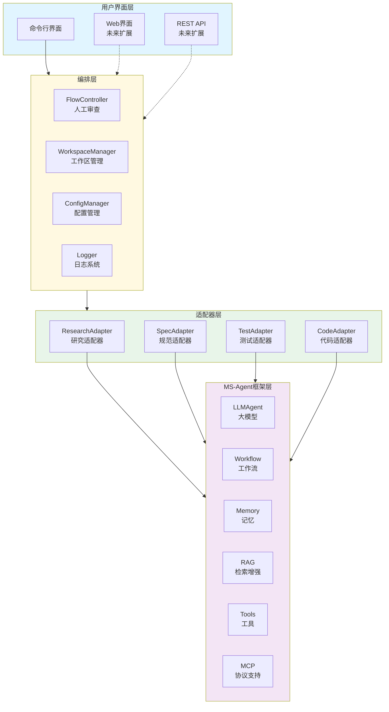

### 1.2 四阶段流水线架构

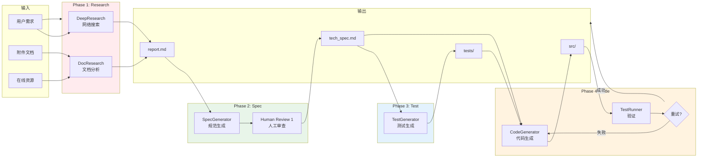

---

## 2. 数据流程图

### 2.1 端到端数据流

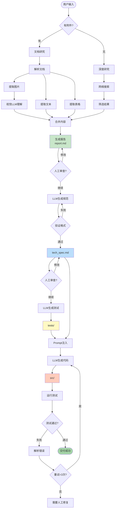

### 2.2 外循环验证流程

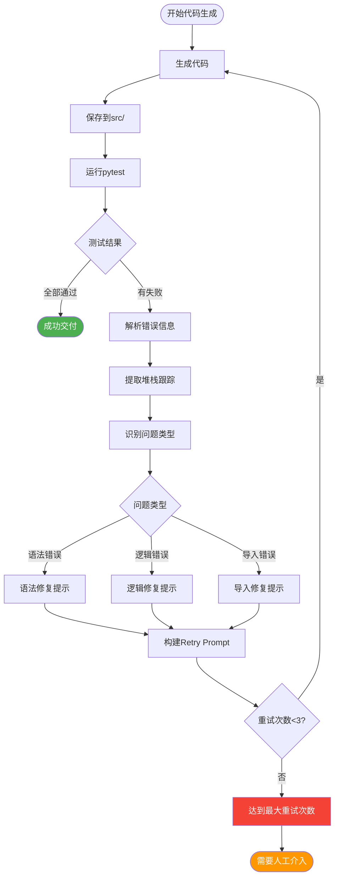

---

## 3. 时序图

### 3.1 完整流程时序图

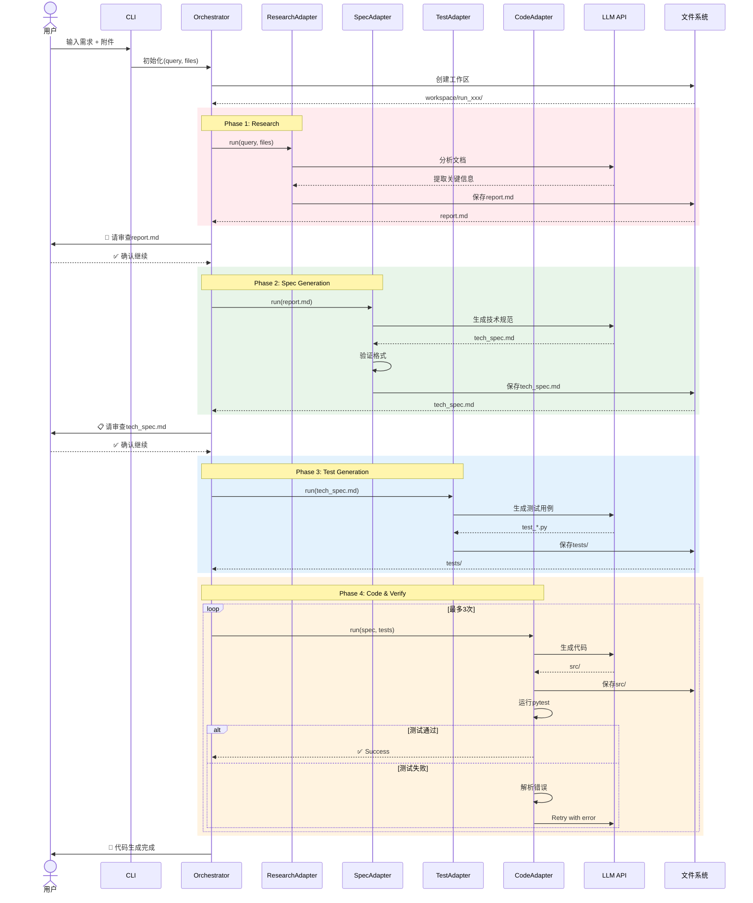

### 3.2 Human-in-the-Loop交互时序

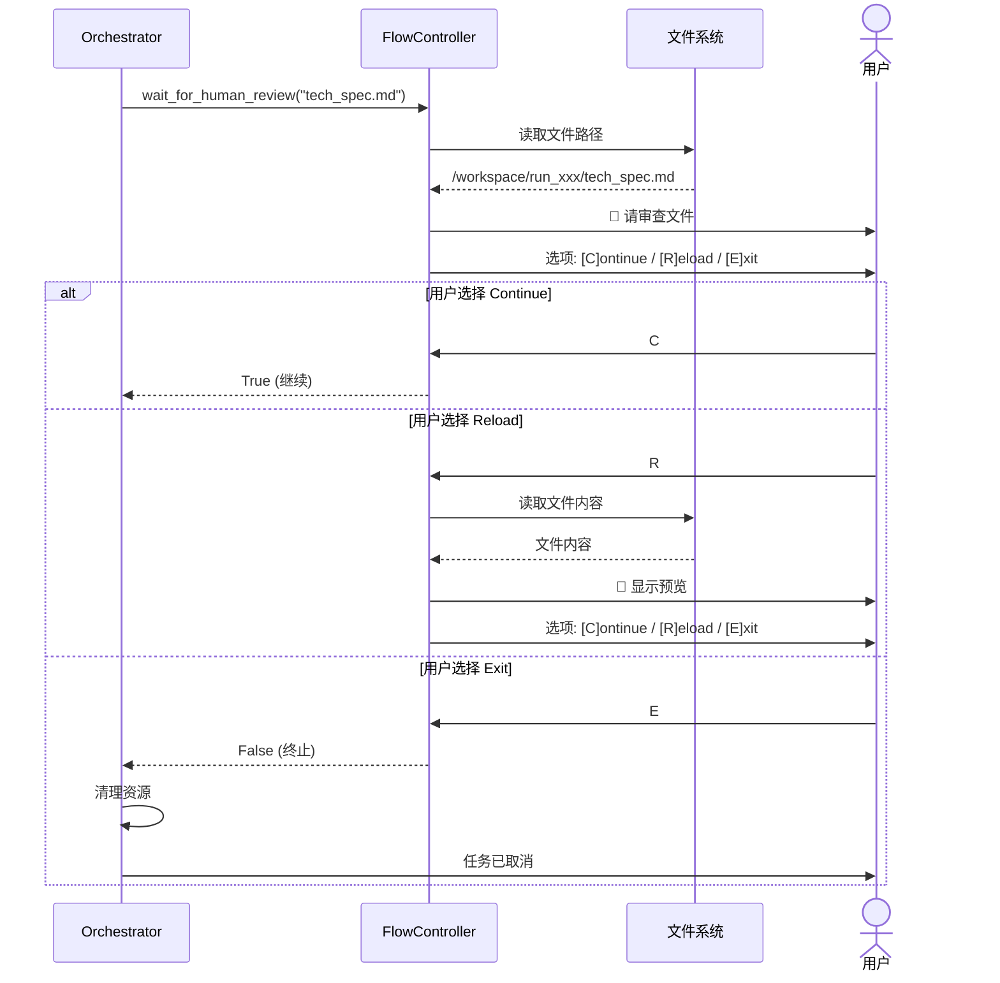

---

## 4. 状态机图

### 4.1 任务生命周期状态机

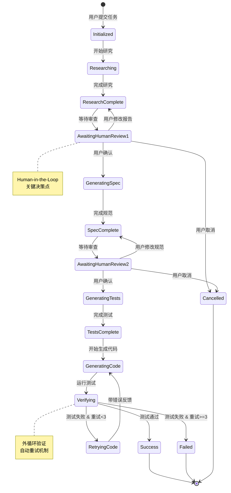

### 4.2 Adapter状态机

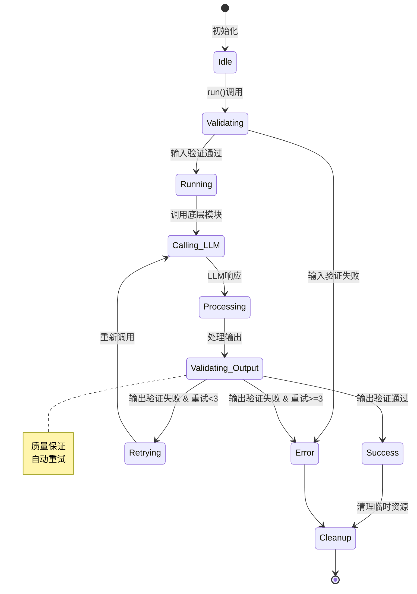

---

## 5. 部署架构图

### 5.1 单机部署架构

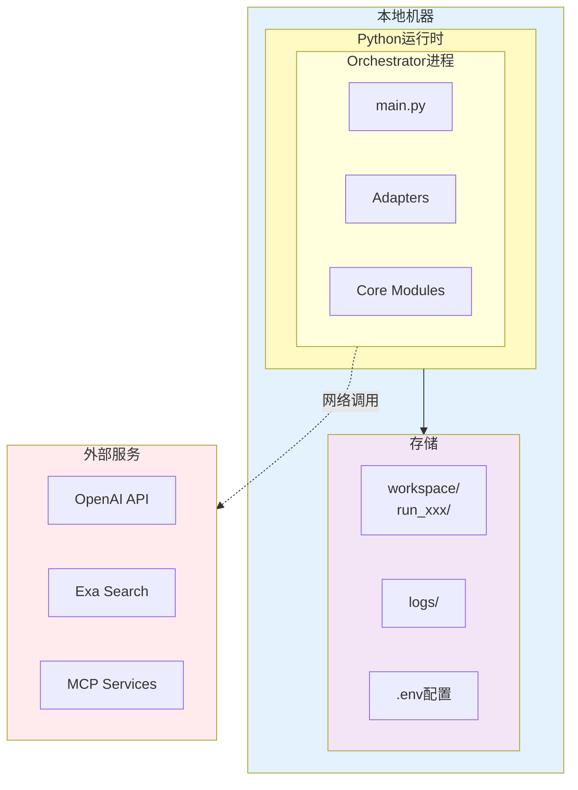

### 5.2 服务化部署架构（未来扩展）

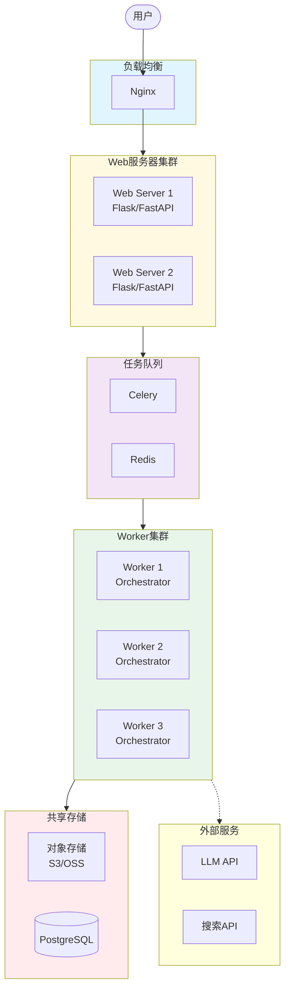

### 5.3 数据存储结构

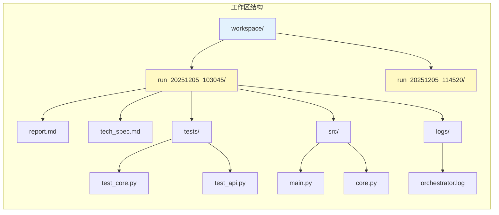

---

## 6. 组件交互图

### 6.1 MCP协议集成

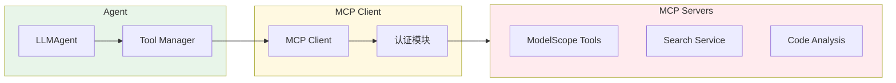

### 6.2 RAG数据流

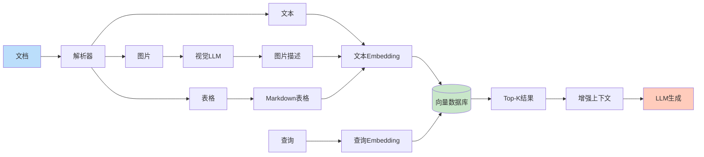

---

## 7. 错误处理流程

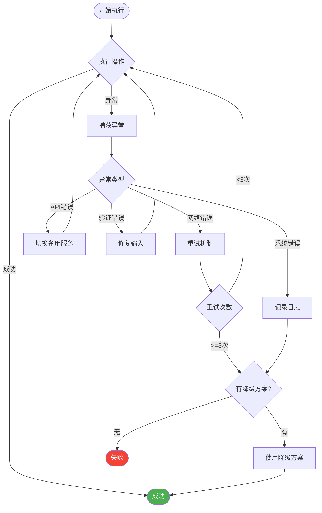

---

## 8. 性能优化策略

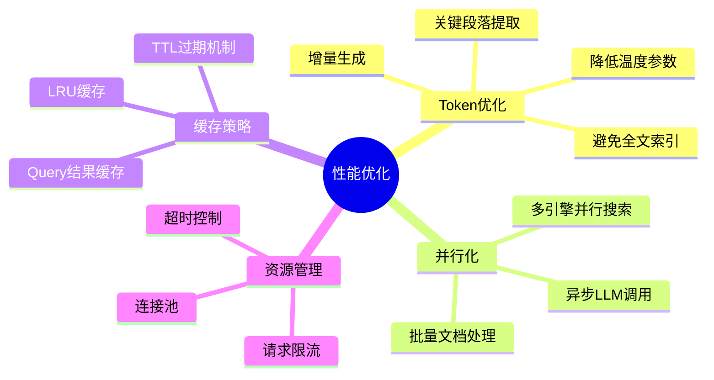

---

## 附录：图例说明

### 颜色编码

- 🟦 **蓝色**: 输入/输出相关
- 🟩 **绿色**: 成功状态
- 🟨 **黄色**: 处理中状态
- 🟧 **橙色**: 警告/注意
- 🟥 **红色**: 错误/失败

### 符号说明

- `-->` : 数据流/控制流
- `-.->` : 可选流程/未来扩展
- `[]` : 进程/模块
- `()` : 开始/结束
- `{}` : 决策点
- `[()]` : 事件

---

**文档说明**: 所有图表使用Mermaid语法，可以在支持Mermaid的Markdown渲染器中查看，如GitHub、GitLab、VS Code等。
