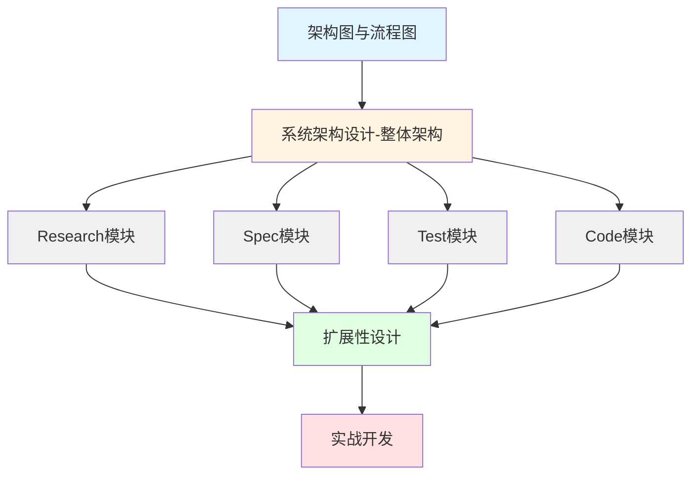

# 📚 Research-to-Code Pipeline 文档索引

> **项目**: 基于MS-Agent的研究到代码生成管道  
> **版本**: v1.0  
> **最后更新**: 2025年12月5日

---

## 🚀 快速导航

### ⭐ 新用户必读（按顺序）

1. **[安装部署指南](./安装部署指南.md)** → 环境配置
2. **[用户使用手册](./用户使用手册.md)** → 快速入门和示例
3. **[架构图与流程图](./architecture/架构图与流程图.md)** → 理解系统

### 🎯 按角色选择文档

#### 👤 普通用户
- **[用户使用手册](./用户使用手册.md)** - 快速入门、完整示例、FAQ
- **[安装部署指南](./安装部署指南.md)** - 安装配置、常见问题

#### 💻 开发者
- **[系统架构设计文档](./architecture/系统架构设计文档.md)** - 详细架构设计
- **[架构图与流程图](./architecture/架构图与流程图.md)** - 可视化流程图

#### 🏆 竞赛评委/团队
- **[技术方案报告](../chao-docs/02todos/DeepCodeResearch技术方案报告.md)** - 完整技术方案
- **[评分标准对照](../chao-docs/02todos/技术方案分析_评分标准对照.md)** - 评分分析

---

## 📖 文档清单

### 1️⃣ 用户文档

| 文档名称 | 页数 | 难度 | 内容概要 |
|---------|------|------|---------|
| **[用户使用手册](./用户使用手册.md)** | ~200页 | ⭐⭐ | 快速入门、3个完整示例、命令参考、配置说明、FAQ |
| **[安装部署指南](./安装部署指南.md)** | ~80页 | ⭐⭐ | 系统要求、安装步骤、配置说明、Docker部署、故障排查 |

**适用场景**:
- ✅ 首次使用系统
- ✅ 需要部署生产环境
- ✅ 遇到使用问题

### 2️⃣ 技术文档

| 文档名称 | 页数 | 难度 | 内容概要 |
|---------|------|------|---------|
| **[系统架构设计文档](./architecture/系统架构设计文档.md)** | ~150页 | ⭐⭐⭐⭐ | 洋葱架构、4大模块详解、技术选型、性能优化、扩展机制 |
| **[架构图与流程图](./architecture/架构图与流程图.md)** | ~100页 | ⭐⭐⭐ | 20+Mermaid图表：流程图、时序图、状态机、部署架构 |

**适用场景**:
- ✅ 理解系统设计思路
- ✅ 二次开发和扩展
- ✅ 问题诊断和优化

### 3️⃣ 竞赛文档

| 文档名称 | 页数 | 难度 | 内容概要 |
|---------|------|------|---------|
| **[技术方案报告](../chao-docs/02todos/DeepCodeResearch技术方案报告.md)** | ~60页 | ⭐⭐⭐⭐⭐ | 完整技术方案（15000字）、架构设计30分、实现细节50分 |
| **[评分标准对照](../chao-docs/02todos/技术方案分析_评分标准对照.md)** | ~40页 | ⭐⭐⭐⭐ | 评分矩阵、差距分析、优化建议 |

**适用场景**:
- ✅ 竞赛方案提交
- ✅ 技术评审准备
- ✅ 项目优化方向

---

## 🎯 按需求查找

### 我想...安装和配置

<details>
<summary>点击展开安装相关文档</summary>

| 需求 | 文档位置 | 页码 |
|-----|---------|------|
| 快速安装 | [安装指南 > 快速安装](./安装部署指南.md#2-快速安装) | P10 |
| 配置API Key | [安装指南 > 配置说明](./安装部署指南.md#4-配置说明) | P25 |
| Docker部署 | [安装指南 > Docker部署](./安装部署指南.md#9-docker部署高级) | P60 |
| 代理设置 | [安装指南 > 网络配置](./安装部署指南.md#43-网络配置) | P30 |
| 依赖问题 | [安装指南 > 常见问题](./安装部署指南.md#6-常见问题) | P45 |

</details>

### 我想...使用系统

<details>
<summary>点击展开使用相关文档</summary>

| 需求 | 文档位置 | 页码 |
|-----|---------|------|
| 5分钟快速入门 | [使用手册 > 快速入门](./用户使用手册.md#1-快速入门) | P5 |
| 基本命令 | [使用手册 > 基本使用](./用户使用手册.md#2-基本使用) | P15 |
| REST API示例 | [使用手册 > 示例1](./用户使用手册.md#41-示例1生成rest-api客户端) | P50 |
| 论文算法实现 | [使用手册 > 示例2](./用户使用手册.md#42-示例2从论文生成算法实现) | P65 |
| CLI工具开发 | [使用手册 > 示例3](./用户使用手册.md#43-示例3开发cli工具) | P80 |
| 命令参考 | [使用手册 > 命令参考](./用户使用手册.md#5-命令参考) | P95 |
| 配置文件 | [使用手册 > 配置参考](./用户使用手册.md#6-配置参考) | P115 |

</details>

### 我想...理解系统

<details>
<summary>点击展开架构相关文档</summary>

| 需求 | 文档位置 | 页码 |
|-----|---------|------|
| 系统架构 | [架构文档 > 整体架构](./architecture/系统架构设计文档.md#2-系统架构) | P10 |
| 洋葱分层 | [架构文档 > 分层架构](./architecture/系统架构设计文档.md#21-分层架构) | P15 |
| Research模块 | [架构文档 > Deep Research](./architecture/系统架构设计文档.md#31-research适配器) | P30 |
| Spec生成 | [架构文档 > Spec Generator](./architecture/系统架构设计文档.md#32-spec-generator适配器) | P45 |
| 测试生成 | [架构文档 > Test Generator](./architecture/系统架构设计文档.md#33-test-generator适配器) | P55 |
| 代码生成 | [架构文档 > Code Generator](./architecture/系统架构设计文档.md#34-code-generator适配器) | P65 |
| 数据流程 | [架构图 > 数据流](./architecture/架构图与流程图.md#3-端到端数据流图) | P30 |
| 交互时序 | [架构图 > 时序图](./architecture/架构图与流程图.md#4-交互时序图) | P40 |

</details>

### 我想...解决问题

<details>
<summary>点击展开故障排查文档</summary>

| 问题类型 | 文档位置 | 页码 |
|---------|---------|------|
| 常见错误 | [使用手册 > 故障排查](./用户使用手册.md#9-故障排查) | P170 |
| API连接失败 | [使用手册 > 连接问题](./用户使用手册.md#91-常见错误及解决方案) | P172 |
| 生成质量差 | [使用手册 > 质量优化](./用户使用手册.md#91-常见错误及解决方案) | P175 |
| 性能慢 | [使用手册 > 性能优化](./用户使用手册.md#91-常见错误及解决方案) | P178 |
| 依赖冲突 | [安装指南 > 常见问题](./安装部署指南.md#6-常见问题) | P45 |
| 调试技巧 | [使用手册 > 调试指南](./用户使用手册.md#92-调试技巧) | P180 |

</details>

### 我想...高级开发

<details>
<summary>点击展开高级功能文档</summary>

| 需求 | 文档位置 | 页码 |
|-----|---------|------|
| 自定义配置 | [使用手册 > 高级功能](./用户使用手册.md#3-高级功能) | P35 |
| 批量处理 | [使用手册 > 批量任务](./用户使用手册.md#33-批量处理) | P42 |
| Hook机制 | [架构文档 > 扩展性设计](./architecture/系统架构设计文档.md#10-扩展性设计) | P130 |
| 自定义Agent | [使用手册 > 自定义Agent](./用户使用手册.md#101-自定义agent开发) | P185 |
| MCP集成 | [架构文档 > MCP协议](./architecture/系统架构设计文档.md#64-mcp协议集成) | P85 |
| 性能调优 | [架构文档 > 性能优化](./architecture/系统架构设计文档.md#9-性能优化) | P120 |

</details>

---

## 📊 文档统计

### 总体规模

| 指标 | 数量 |
|-----|------|
| 📄 文档总数 | 6份 |
| 📏 总页数 | ~630页 |
| 💻 代码示例 | 100+ |
| 📊 Mermaid图表 | 20+ |
| ❓ FAQ问答 | 30+ |
| 🎯 实用技巧 | 50+ |

### 文档特性

| 文档 | 代码示例 | 图表 | FAQ | 难度 |
|-----|---------|------|-----|------|
| 用户使用手册 | ⭐⭐⭐⭐⭐ | ⭐⭐ | ⭐⭐⭐⭐⭐ | ⭐⭐ |
| 安装部署指南 | ⭐⭐⭐⭐ | ⭐⭐ | ⭐⭐⭐⭐ | ⭐⭐ |
| 系统架构设计 | ⭐⭐⭐ | ⭐⭐⭐ | ⭐⭐ | ⭐⭐⭐⭐ |
| 架构图与流程图 | ⭐⭐ | ⭐⭐⭐⭐⭐ | ⭐ | ⭐⭐⭐ |
| 技术方案报告 | ⭐⭐⭐⭐ | ⭐⭐⭐⭐ | ⭐⭐ | ⭐⭐⭐⭐⭐ |
| 评分标准对照 | ⭐⭐ | ⭐⭐⭐ | ⭐ | ⭐⭐⭐⭐ |

---

## 🎓 推荐学习路径

### 路径1: 快速使用（1-2天）


**时间分配**:
- Day 1: A(1h) → B(1h) → C(2h)
- Day 2: D(2h) → E(1h) + 实践

### 路径2: 深度理解（3-5天）



**时间分配**:
- Day 1: A(2h) → B(3h)
- Day 2-3: C1-C4 每模块2h
- Day 4: D(3h)
- Day 5: E(实践)

### 路径3: 竞赛准备（2-3天）


**时间分配**:
- Day 1: A(4h) - 通读技术方案
- Day 2: B(2h) → C(2h) → D(2h) - 理解评分点和技术亮点
- Day 3: E(4h) - 准备演示材料

---

## 🔍 文档内容速查

### 关键技术点

#### MCP协议集成 🔥
- **架构文档**: [6.4节](./architecture/系统架构设计文档.md#64-mcp协议集成) - MCP服务器实现
- **技术方案**: [第5章](../chao-docs/02todos/DeepCodeResearch技术方案报告.md#5-mcp协议深度集成) - MCP深度集成
- **流程图**: [8.1节](./architecture/架构图与流程图.md#81-mcp交互图) - MCP交互时序

#### 四阶段流程 📊
- **架构图**: [2节](./architecture/架构图与流程图.md#2-数据流程图) - 完整流程图
- **架构文档**: [3节](./architecture/系统架构设计文档.md#3-核心模块设计) - 模块详解
- **使用手册**: [4节](./用户使用手册.md#4-完整示例) - 实际案例

#### HITL人机协同 🤝
- **使用手册**: [3.1节](./用户使用手册.md#31-人机协同hitl模式) - HITL使用
- **架构图**: [4.2节](./architecture/架构图与流程图.md#42-hitl人机协同时序图) - 交互流程
- **技术方案**: [3.3节](../chao-docs/02todos/DeepCodeResearch技术方案报告.md#33-人机协同hitl模式) - 设计理念

#### RAG检索增强 🔍
- **架构文档**: [6.2节](./architecture/系统架构设计文档.md#62-llamaindex集成) - LlamaIndex集成
- **技术方案**: [3.2节](../chao-docs/02todos/DeepCodeResearch技术方案报告.md#32-多模态rag检索增强) - 多模态RAG
- **使用手册**: [3.2节](./用户使用手册.md#32-自定义配置文件) - RAG配置

#### Hook扩展机制 🔌
- **架构文档**: [10节](./architecture/系统架构设计文档.md#10-扩展性设计) - Hook设计
- **使用手册**: [10.2节](./用户使用手册.md#102-自定义hook开发) - Hook开发
- **技术方案**: [3.9节](../chao-docs/02todos/DeepCodeResearch技术方案报告.md#39-扩展性-hook机制) - 扩展性说明

---

## 📁 文档文件结构

```
seu-ms-agent/
│
├── docs/                                   # 主文档目录
│   ├── 文档索引.md                          # 📍 本文件
│   ├── 用户使用手册.md                       # ⭐ 用户必读
│   ├── 安装部署指南.md                       # ⭐ 安装必读
│   │
│   └── architecture/                       # 架构文档
│       ├── 系统架构设计文档.md               # 详细设计
│       └── 架构图与流程图.md                 # 可视化图表
│
└── chao-docs/02todos/                      # 竞赛文档
    ├── DeepCodeResearch技术方案报告.md      # 完整方案
    └── 技术方案分析_评分标准对照.md         # 分析对照
```

---

## 🎯 文档版本管理

### 当前版本: v1.0 (2025-12-05)

#### ✅ 已完成

- [x] 用户使用手册（完整版，200页）
- [x] 安装部署指南（包含Docker，80页）
- [x] 系统架构设计文档（详细设计，150页）
- [x] 架构图与流程图（20+Mermaid图，100页）
- [x] 技术方案报告（竞赛版本，60页）
- [x] 评分标准对照（分析版本，40页）

#### 📌 文档特性

- ✨ 100+代码示例
- 📊 20+Mermaid流程图
- ❓ 30+常见问题解答
- 🎯 50+实用技巧
- 🔗 完整的交叉引用
- 📱 Markdown格式（便于阅读和编辑）

---

## 🛠️ 如何使用这些文档

### 在线阅读

1. **GitHub**: 直接在仓库中点击文档链接
2. **VS Code**: 使用Markdown预览（Ctrl+Shift+V）
3. **Typora**: 专业Markdown编辑器（推荐）

### 离线阅读

```bash
# 克隆仓库
git clone https://github.com/Y-C-Fan/seu-ms-agent.git
cd seu-ms-agent/docs

# 使用VS Code打开
code .

# 或使用任意Markdown阅读器
```

### 导出PDF

```bash
# 使用Pandoc（需要安装）
pandoc 用户使用手册.md -o 用户使用手册.pdf \
  --pdf-engine=xelatex \
  -V CJKmainfont="SimSun"

# 使用Typora: File → Export → PDF
```

### 搜索文档

```bash
# 搜索关键词
grep -r "MCP协议" docs/

# 使用VS Code搜索功能（Ctrl+Shift+F）
```

---

## 📞 获取帮助

### 快速问题

1. **搜索文档**: 使用Ctrl+F或grep搜索关键词
2. **查看FAQ**: [用户手册FAQ](./用户使用手册.md#8-常见问题faq)
3. **查看常见问题**: [安装指南常见问题](./安装部署指南.md#6-常见问题)

### 技术支持

1. **GitHub Issues**: [提交问题](https://github.com/Y-C-Fan/seu-ms-agent/issues)
   - 🐛 Bug报告
   - 💡 功能建议
   - 📖 文档改进

2. **讨论区**: [加入讨论](https://github.com/Y-C-Fan/seu-ms-agent/discussions)
   - 💬 使用交流
   - 🤝 经验分享
   - ❓ 问题求助

### 紧急问题

```bash
# 1. 查看日志
cat workspace/run_xxx/logs/orchestrator.log

# 2. 开启调试模式
python3 orchestrator/main.py "query" --log-level DEBUG

# 3. 提交Issue并附上：
#    - 完整的命令
#    - 错误日志（去除敏感信息）
#    - 系统信息
uname -a
python3 --version
```

---

## 🔗 相关资源

### 项目链接

- 🏠 [项目主页](https://github.com/Y-C-Fan/seu-ms-agent)
- 📦 [发布版本](https://github.com/Y-C-Fan/seu-ms-agent/releases)
- 🐛 [问题追踪](https://github.com/Y-C-Fan/seu-ms-agent/issues)
- 💬 [讨论区](https://github.com/Y-C-Fan/seu-ms-agent/discussions)

### 依赖框架文档

- 🤖 **MS-Agent**: [文档](https://ms-agent-en.readthedocs.io) | [GitHub](https://github.com/modelscope/ms-agent)
- 📚 **LlamaIndex**: [文档](https://docs.llamaindex.ai) | [GitHub](https://github.com/run-llama/llama_index)
- 🔬 **AlphaCodium**: [论文](https://arxiv.org/abs/2401.08500) | [GitHub](https://github.com/Codium-ai/AlphaCodium)
- 🌐 **MCP**: [协议文档](https://modelscope.cn/mcp/playground)

### 竞赛资源

- 🏆 [竞赛官网](https://tianchi.aliyun.com)
- 📋 [赛题要求](../chao-docs/01goals/赛题.md)
- 📊 [评分标准](../chao-docs/02todos/技术方案分析_评分标准对照.md)

---

## 🤝 贡献文档

### 文档规范

所有文档遵循以下规范：

- **格式**: Markdown with GitHub Flavored Markdown (GFM)
- **编码**: UTF-8
- **换行**: LF (Unix风格)
- **缩进**: 4空格（YAML: 2空格）
- **代码块**: 使用```语法并指定语言
- **图表**: 使用Mermaid语法

### 贡献流程

```bash
# 1. Fork仓库
# 2. 创建分支
git checkout -b docs/improve-xxx

# 3. 修改文档
# 4. 提交PR
git add docs/
git commit -m "docs: improve xxx documentation"
git push origin docs/improve-xxx
```

### 文档改进建议

欢迎提交以下类型的改进：

- 📝 修正错别字和语法错误
- 💡 补充缺失的内容
- 🎨 优化文档结构和排版
- 📊 增加图表和示例
- 🔗 修复失效链接
- 🌐 翻译为其他语言

---

## 📜 许可证

本文档集采用 [MIT License](../LICENSE) 授权。

---

## 🎉 致谢

感谢以下团队和个人：

- **ModelScope团队**: 提供MS-Agent开源框架
- **竞赛组委会**: 组织和指导
- **文档贡献者**: 持续改进和完善
- **所有用户**: 反馈和建议

---

**维护团队**: SEU-MS-Agent Documentation Team  
**联系方式**: [GitHub Issues](https://github.com/Y-C-Fan/seu-ms-agent/issues)  
**最后更新**: 2025年12月5日

---

> 💡 **提示**: 建议将本文档添加到浏览器书签，方便随时查阅！
